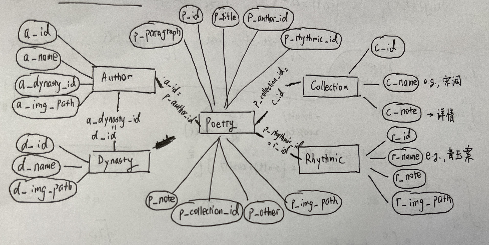

# chinese-poetry-db-web：一个基于chinese-poetry的数据库和网页UI

## 鸣谢
<a href="https://github.com/chinese-poetry/chinese-poetry/tree/master#chinese-poetry-%E6%9C%80%E5%85%A8%E4%B8%AD%E6%96%87%E8%AF%97%E6%AD%8C%E5%8F%A4%E5%85%B8%E6%96%87%E9%9B%86%E6%95%B0%E6%8D%AE%E5%BA%93">chinese-poetry: 最全中文诗歌古典文集数据库</a>

## 包含
- 唐宋诗
- 宋词
- 曹操诗集
- 五代 花间集
- 五代 南唐
- 元曲
- 楚辞
- 论语
- 纳兰性德


## 使用方法
1. 利用chinese-poetry-collection8.zip解压后的利用chinese-poetry-collection8.sql导入到一个叫做"chinese-poetry-collection"的MySQL数据库
2. 安装必要依赖：flask, opencc, pymysql
```
xxx/chinese-poetry-db-web$user-1> pip3 install -r requirements.txt
```
3. 在本仓库进行：后端（flask），启动！
```
xxx/chinese-poetry-db-web$user-1> python3 server.py
```
4. 在本仓库下面的"chinese-poetry-web"进行：前端（node），启动！
```
xxx/chinese-poetry-db-web/chinese-poetry-web$user-1> npm install
xxx/chinese-poetry-db-web/chinese-poetry-web$user-1> npm run dev
```
5. （可选）前端打包部署

## 数据库设计
使用MySQL


Poetry:
- p_id: 诗词Id
- p_title: 诗词标题
- p_author_id: 作者Id，连表查询时使用，对应author表a_id
- p_rhythmic_id: 词牌/旋律Id，连表查询时使用，对应rhythmic表r_id
- p_paragraph: 正文
- p_note: 注释
- p_collection_id: 诗集/文集Id，连表查询时使用，对应Collection表c_id
- p_other: 闲置
- p_img_path: 后续配图使用路径

Author:
- a_id: 作者Id
- a_name: 作者姓名（e.g., 李白）
- a_dynasty_id: 朝代Id，连表查询时使用，对应dynasty表d_id
- a_img_path: 后续配图使用路径

Dynasty:
- d_id: 朝代Id
- d_name: 朝代名称（e.g., 宋朝）
- d_img_path: 后续配图使用路径

Collection:
- c_id: 诗集/文集Id
- c_name: 诗集/文集名称（e.g., 宋词）
- c_note: 详情

Rhythmic:
- r_id: 词牌/旋律Id
- r_name: 词牌/旋律名称（e.g., 青玉案）
- r_note: 详情
- r_img_path: 后续配图使用路径

## 后端
server.py，使用Flask制成，全部方法为GET

### /search/poem
通过字符串查询 诗词

#### 参数
- query_str：查询字符串
- query_type：查询模式，必须为"title"（标题查询）, "para"（正文查询）, "rhy"（词牌/韵律查询）, 或"author"（作者查询）其中一种
- items_per_page：每页查询个数
- curr_page：目前页数（从1开始）

#### 返回
```
{
    "code": 0,
    "msg": "",
    "num_res": 59,
    "result": [
        {
          "a_id": 251,
          "a_name": "張子容",
          "p_id": 1389,
          "p_paragraph": "林花發岸口，氣色動江新。\n此夜江中月，流光花上春。\n分明石潭裏，宜照浣紗人。",
          "p_title": "相和歌辭 春江花月夜二首 一",
          "r_id": null,
          "r_name": null
        }, ...
    ]
}
```


### /search/author
通过字符串查询 作者

#### 参数
- query_str：查询字符串
- items_per_page：每页查询个数
- curr_page：目前页数（从1开始）

#### 返回

```
{
    "code": 0,
    "msg": "",
    "num_res": 2,
    "result": [
        {
            "a_id": 13628,
            "a_name": "温庭筠",
            "d_id": 4,
            "d_name": "五代"
        }, ...
    ]
}
```


### /search/rhythmic
通过字符串查询 词牌/韵律

#### 参数
- r_name：查询字符串
- items_per_page：每页查询个数
- curr_page：目前页数（从1开始）

#### 返回
```
{
    "code": 0,
    "msg": "",
    "num_res": 2,
    "result": [
        {
            "r_id": 362,
            "r_img_path": null,
            "r_name": "青玉案",
            "r_note": ""
        }, ...
    ]
}
```

### /query/poem_by_id
通过poem的Id查询完整的 诗词信息

#### 参数
- p_id：poem的Id

#### 返回

```
{
  "a_id": 173,
  "a_name": "溫庭筠",
  "c_name": "唐宋诗",
  "d_name": "唐朝",
  "p_id": 26316,
  "p_img_path": null,
  "p_note": null,
  "p_paragraph": "晨起動征鐸，客行悲故鄉。\n雞聲茅店月，人迹板橋霜。\n槲葉落山路，枳花明驛牆。\n因思杜陵夢，鳧雁滿迴塘。",
  "p_title": "商山早行",
  "r_id": null,
  "r_name": null
}
```

### /query/poem_by_author
通过author的Id查询 诗词列表

#### 参数
- a_id：author的Id
- items_per_page：每页查询个数
- curr_page：目前页数（从1开始）

#### 返回

```
[
  {
      "a_id": 173,
      "a_name": "溫庭筠",
      "p_id": 1023,
      "p_paragraph": "太子池南樓百尺，八窗新樹疎簾隔。\n黃金鋪首畫鉤陳，羽葆亭童拂交戟。\n盤紆闌楯臨高臺，帳殿臨流鸞扇開。\n早雁聲鳴細波起，映花鹵簿龍飛回。",
      "p_title": "橫吹曲辭 雍臺歌",
      "r_id": null,
      "r_name": null
  }, ...
]
```

### /query/poem_by_rhythmic
通过rhythmic的Id查询 诗词列表

#### 参数
- r_id：rhythmic的Id
- items_per_page：每页查询个数
- curr_page：目前页数（从1开始）

#### 返回

```
[
  {
    "a_id": 12455,
    "a_name": "苏轼",
    "p_id": 313147,
    "p_paragraph": "大江东去，浪淘尽、千古风流人物。\n故垒西边人道是，三国周郎赤壁。\n乱石穿空，惊涛拍岸，卷起千堆雪。\n江山如画，一时多少豪杰。\n遥想公瑾当年，小乔初嫁了，雄姿英发。\n羽扇纶巾谈笑间，强虏灰飞烟灭。\n故国神游，多情应笑，我早生华发。\n人间如梦，一尊还酹江月。",
    "p_title": null,
    "r_id": 282,
    "r_name": "念奴娇"
  }, ...
]
```

### /query/poem_by_collection
通过collection的Id查询 诗词列表

#### 参数
- c_id：collection的Id
- items_per_page：每页查询个数
- curr_page：目前页数（从1开始）

#### 返回

```
[
  {
    "a_id": 7,
    "a_name": "太宗皇帝",
    "p_id": 1,
    "p_paragraph": "秦川雄帝宅，函谷壯皇居。\n綺殿千尋起，離宮百雉餘。\n連甍遙接漢，飛觀迥凌虛。\n雲日隱層闕，風煙出綺疎。",
    "p_title": "帝京篇十首 一",
    "r_id": null,
    "r_name": null
  }, ...
]
```

### /query/random_poem
获取一个随机诗词

#### 参数
- 无

#### 返回

```
{
    "a_id": 4901,
    "a_name": "楊萬里",
    "c_name": "唐宋诗",
    "d_name": "宋朝",
    "p_id": 106261,
    "p_img_path": null,
    "p_note": null,
    "p_paragraph": "天公也自喜良辰，上巳風光忽斬新。\n點檢一春好天色，更無兩日似今晨。",
    "p_title": "三月三日上忠襄墳因之行散得十絕句  其四",
    "r_id": null,
    "r_name": null
}
```

### /display/author
获取随机作者

#### 参数
- items_per_page：随机获取个数

#### 返回

```
[
    {
        "a_id": 13628,
        "a_name": "温庭筠",
        "d_id": 4,
        "d_name": "五代"
    }, ...
]
```

### /display/rhythmic
获取rhythmic 列表

#### 参数
- items_per_page：每页查询个数
- curr_page：目前页数（从1开始）

#### 返回

```
[
  {
    "r_id": 2,
    "r_img_path": null,
    "r_name": "六州",
    "r_note": ""
  },
  {
    "r_id": 3,
    "r_img_path": null,
    "r_name": "十二时・忆少年",
    "r_note": ""
  }, ...
]
```

### /display/collection
获取collection 列表

#### 参数
- 无

#### 返回

```
[
  {
    "c_id": 6,
    "c_name": "唐宋诗",
    "c_note": "《全唐诗》是清康熙四十四年（1705年），彭定求、沈三曾、杨中讷、汪士鋐、汪绎、俞梅、徐树本、车鼎晋、潘从律、查嗣瑮10人奉敕编校，“得诗四万八千九百余首，凡二千二百余人”， 共计900卷，目录12卷。 来自百科\r\n\r\n《全宋诗》继唐诗的高度繁荣之后，宋诗在思想内容和艺术表现上有新的开拓和创造，出现了许多优秀作家作品，形成了许多流派，对元、明、清的诗歌发展产生了深远影响。来自百科"
  }, ...
]
```

## 前端
Vue 3 + Naive UI

## 截图


